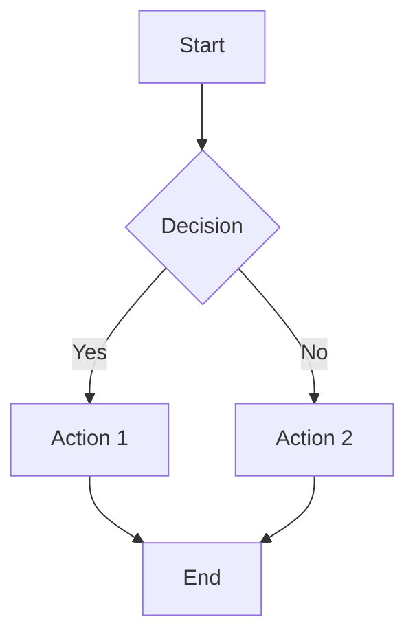
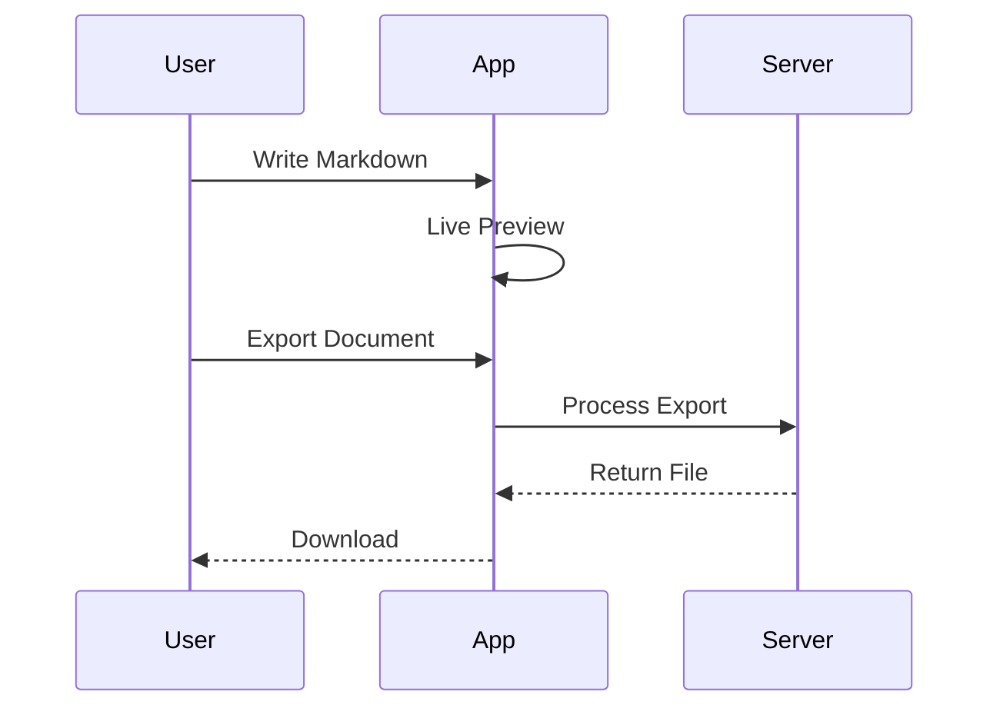
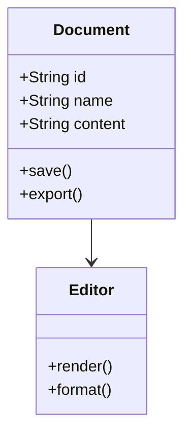

# Welcome to MarkView!

**MarkView** is a powerful, modern Markdown editor with live preview. Write beautiful documentation, notes, and more with real-time visualization.

---

## Table of Contents

1. [Getting Started](#getting-started)
2. [Markdown Syntax](#markdown-syntax)
3. [Advanced Features](#advanced-features)
4. [Export Options](#export-options)
5. [View Modes](#view-modes)
6. [Keyboard Shortcuts](#keyboard-shortcuts)
7. [Settings & Customization](#settings--customization)

---

## Getting Started

### Creating Documents

- **New Document**: `Ctrl+N` or **File > New**
- **Import Files**: Drag & drop `.md` files or use **File > Import**
- **Multiple Tabs**: Work with several documents at once

### Saving Your Work

- **Auto-save**: Your changes are automatically saved
- **Manual Save**: `Ctrl+S` or **File > Save**
- **Version History**: Access previous versions via **right-click on tab**

---

## Markdown Syntax

### Text Formatting

| Style | Syntax | Result |
|-------|--------|--------|
| Bold | `**text**` | **text** |
| Italic | `*text*` | *text* |
| Bold & Italic | `***text***` | ***text*** |
| Strikethrough | `~~text~~` | ~~text~~ |
| Inline Code | `` `code` `` | `code` |

### Headings

```markdown
# Heading 1
## Heading 2
### Heading 3
#### Heading 4
##### Heading 5
###### Heading 6
```

### Lists

**Bullet List:**
- First item
- Second item
  - Nested item

**Numbered List:**
1. First step
2. Second step
3. Third step

**Task List:**
- [x] Completed task
- [ ] Pending task
- [ ] Another task

### Links and Images

```markdown
[Link Text](https://example.com)

```

### Blockquotes

> This is a blockquote.
> It can span multiple lines.

### Horizontal Rule

Use `---` to create a horizontal line separator.

---

## Advanced Features

### Code Blocks with Syntax Highlighting

MarkView supports syntax highlighting for 100+ programming languages:

```javascript
// JavaScript
function greet(name) {
    return `Hello, ${name}!`;
}

const users = ['Alice', 'Bob', 'Charlie'];
users.forEach(user => console.log(greet(user)));
```

```python
# Python
def fibonacci(n):
    if n <= 1:
        return n
    return fibonacci(n - 1) + fibonacci(n - 2)

print([fibonacci(i) for i in range(10)])
```

```typescript
// TypeScript
interface User {
    id: number;
    name: string;
    email: string;
}

const createUser = (data: Partial<User>): User => ({
    id: Date.now(),
    name: 'Anonymous',
    email: '',
    ...data
});
```

### Mermaid Diagrams

Create flowcharts, sequence diagrams, and more:

**Flowchart:**



**Sequence Diagram:**



**Class Diagram:**



### Mathematical Formulas (KaTeX)

Write beautiful math equations:

**Inline Math:** The formula $E = mc^2$ changed physics forever.

**Block Math:**

$$
\int_{-\infty}^{\infty} e^{-x^2} dx = \sqrt{\pi}
$$

$$
f(x) = \sum_{n=0}^{\infty} \frac{f^{(n)}(a)}{n!}(x-a)^n
$$

$$
\begin{pmatrix}
a & b \\
c & d
\end{pmatrix}
\begin{pmatrix}
x \\
y
\end{pmatrix}
=
\begin{pmatrix}
ax + by \\
cx + dy
\end{pmatrix}
$$

### Callouts

Use callouts to highlight important information:

> **NOTE:** This is informational content that provides additional context.

> **TIP:** A helpful suggestion to improve your workflow.

> **WARNING:** Important information that requires attention.

> **IMPORTANT:** Critical information you should not miss.

> **CAUTION:** Proceed with care when following these instructions.

### Tables

| Feature | Description | Shortcut |
|---------|-------------|----------|
| Bold | Make text bold | `Ctrl+B` |
| Italic | Make text italic | `Ctrl+I` |
| Link | Insert hyperlink | `Ctrl+K` |
| Code | Insert code block | `Ctrl+Shift+`` |

---

## Export Options

Export your documents in multiple formats:

| Format | Description | Use Case |
|--------|-------------|----------|
| **Markdown** (.md) | Raw markdown file | Sharing, version control |
| **HTML** | Styled web page | Web publishing |
| **PDF** | Portable document | Printing, sharing |
| **PNG** | Image format | Social media, presentations |
| **JPEG** | Compressed image | Quick sharing |

Access exports via **File > Export** or right-click menu.

---

## View Modes

### Split View (Default)

See your editor and preview side by side. Perfect for writing and checking formatting simultaneously.

### Editor Only

Focus entirely on writing. Hide the preview for distraction-free editing.

### Preview Only

Review your final document without the editor visible.

### Preview in New Window

Open the preview in a separate window. Great for dual-monitor setups.

### Zen Mode

Press `F11` for a completely distraction-free writing experience. All UI elements are hidden, leaving only your content.

---

## Keyboard Shortcuts

### Text Formatting

| Shortcut | Action |
|----------|--------|
| `Ctrl+B` | Bold |
| `Ctrl+I` | Italic |
| `Ctrl+Shift+S` | Strikethrough |
| `Ctrl+`` | Inline code |
| `Ctrl+Shift+`` | Code block |

### Headings

| Shortcut | Action |
|----------|--------|
| `Ctrl+1` | Heading 1 |
| `Ctrl+2` | Heading 2 |
| `Ctrl+3` | Heading 3 |
| `Ctrl+4` to `Ctrl+6` | Heading 4-6 |

### Lists

| Shortcut | Action |
|----------|--------|
| `Ctrl+Shift+8` | Bullet list |
| `Ctrl+Shift+7` | Numbered list |
| `Ctrl+Shift+9` | Task list |

### Insert Elements

| Shortcut | Action |
|----------|--------|
| `Ctrl+K` | Insert link |
| `Ctrl+Shift+I` | Insert image |
| `Ctrl+Shift+Q` | Blockquote |

### Navigation & Search

| Shortcut | Action |
|----------|--------|
| `Ctrl+G` | Go to line |
| `Ctrl+F` | Find |
| `Ctrl+H` | Find and replace |
| `F3` | Find next |
| `Shift+F3` | Find previous |

### Application

| Shortcut | Action |
|----------|--------|
| `Ctrl+N` | New document |
| `Ctrl+S` | Save |
| `Ctrl+W` | Close tab |
| `Ctrl+B` | Toggle sidebar |
| `Ctrl+,` | Settings |
| `Ctrl+/` | Keyboard shortcuts |
| `F11` | Zen mode |
| `Esc` | Exit Zen mode / Close modal |

### Zoom

| Shortcut | Action |
|----------|--------|
| `Ctrl++` | Zoom in |
| `Ctrl+-` | Zoom out |
| `Ctrl+0` | Reset zoom |
| `Ctrl+Scroll` | Zoom with mouse wheel |

---

## Settings & Customization

Access settings via `Ctrl+,` or **File > Settings**:

### Appearance

- **Theme**: Light, Dark, or System (auto-detect)
- **Preview Style**: GitHub or Default
- **Font Size**: Adjustable for editor and preview

### Editor

- **Auto-save**: Automatically save changes
- **Format on Save**: Clean up markdown on save
- **Line Numbers**: Show/hide line numbers
- **Word Wrap**: Enable/disable text wrapping

### Language

- English
- Spanish (Espanol)

---

## Sidebar Features

### File Explorer

Manage all your open documents. Right-click for options:
- Rename
- Close
- Close Others
- Close All

### Table of Contents

Navigate through your document's headings. Click any heading to jump to that section.

### Search & Replace

- **Find**: Search within the current document
- **Replace**: Replace single or all occurrences
- **Options**: Case sensitive, Regular expressions

---

## Tips & Tricks

1. **Drag & Drop**: Drop `.md` files directly into the editor
2. **Tab Management**: Right-click tabs for quick actions
3. **Version History**: Never lose your work with automatic versioning
4. **Emoji Support**: Use the emoji picker in the toolbar
5. **Quick Headings**: Use the heading dropdown in the toolbar

---

## Need Help?

- Press `Ctrl+/` to view all keyboard shortcuts
- Check the **Help** menu for the feature tour
- Visit our [documentation](https://github.com/qazuor/markview)

---

Happy writing!
